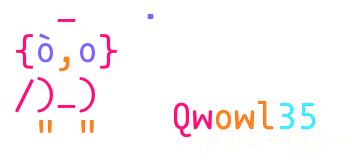

> [!WARNING]
> This project is still incomplete and not really suitable for practical use yet — but it's a fun one to experiment with as a recreational project.

<div align="center">
  <a href="assets/qwowl35.png">
    
  </a>
</br>
(pronounced /kwaʊl/, a portmanteau of <strong>Qwen</strong> and <strong>owl</strong>)
</br>
<em>A <strong>Metal-backed</strong> inference engine for Qwen 3.5.</em>
</br>
</div>
</br>
</br>

Designed to sit inside **agentic loops** on a MacBook Air M2.

For facts about the served model itself — architecture, weight formats,
reasoning modes, chat encoding, sampling — see [`MODEL_CARD.md`](MODEL_CARD.md).

## Motivation

This project started with a simple goal: to run **Qwen 3.5 9B** — a model small
enough to fit, yet capable enough to assist with light coding tasks — entirely
on my local machine, a **MacBook Air M2**. From there it grew into a playground
for exploring optimization on several fronts: token efficiency, smarter
tool-calling, threading during inference, and a friendly user interface.

It is not meant to be a product for the public. It's a recreational experiment —
I do it because it's fun. My hope is that some of the things I ran into along the
way turn out to be useful to other programmers.

## What I've learned so far

- **`gf4` quantization is pure and uniform.** Every layer is quantized to
  exactly 4 bits per weight. It is a 4-bit *grouped floating point* format: 8
  values are packed into 32 bits, using a 3-bit quantized scale per value plus a
  single fp8 scale shared across the group. The format comes from zeux's
  [`calm`](https://github.com/zeux/calm); here it's used as an optional
  decode-time sidecar, where the smaller weights buy faster generation on the
  memory-bound decode path — still very much a work in progress.
- **Anchor-based file editing is token-efficient.** The editing tools key off
  `<line number>:<checksum> | <code>` anchors instead of the classic "replace
  old string with new string" approach, which costs noticeably fewer tokens for
  the same edit.
- **Different GPU layouts want different thread decompositions.** How work is
  split across threads during inference has to change with the layout; there is
  no single partitioning that's best everywhere.
- **Restricted bash plus a parsing policy is a solid first security layer.**
  Running a restricted bash, combined with a policy that parses commands to
  separate the suspicious from the benign, seems to be an effective first line
  of defense.
- **An adaptive KV-cache window pays off.** Growing the cache to fit the context
  rather than preallocating it saves a meaningful amount of memory.
- **`q8_0` is the smallest quantization I'd actually trust** — and even then I
  still have doubts about what that numerical compression really costs.
- **The MacBook runs *hot*.** Sustained inference heats it up enough that an
  external cooling setup is essentially required.

## Layout

- `qw35-server/` — Rust crate. The HTTP inference server and the Metal
  engine (lib `qw35_server`, binary `qw35`).
- `qw35-bench/` — Rust crate. The benchmark binary (`qw35-bench`), with
  `http`, `direct`, and `host` subcommands. Depends on `qw35-server`.
- `qw35-client/` — Python. Interactive REPL that talks to the server
  (`python -m qw35_client`).
- `qw35-tool/` — Python. Offline utilities: GGUF metadata dumper and
  GF4 sidecar cooker.
- `qw35-tui/` — Python. `qwowl35`, a Textual terminal coding agent that
  drives the server in a tool-calling loop (`python -m qwowl35`).
- `.gguf/` — Model weights and pre-cooked sidecars (kept at the repo
  root so the server's cwd-relative default path resolves).

## Getting the model

The weights are git-ignored, so a fresh checkout has none. Fetch them with:

```
./download_model.sh         # base GGUF -> .gguf/Qwen3.5-9B-Q4_K_M.gguf (~5.3 GB)
./download_model.sh gf4     # cook the optional GF4 decode sidecar (CPU-heavy)
./download_model.sh all     # both
```

The GGUF comes from `unsloth/Qwen3.5-9B-GGUF` on Hugging Face; pass `--token`
(or set `HF_TOKEN`) if you need authentication, and `QW35_GGUF_DIR` to change the
target directory. The GF4 sidecar is not downloadable — `gf4` cooks it locally
from the GGUF with `qw35-tool` (needs `python3` + `numpy` + `gguf`); the server
runs fine without it (just slower decode) and picks it up automatically when
present. If you start the server (`make run`) without the model, it offers to run
the downloader for you.

## Quickstart

With the model in place (see above), start the server and query it with any
OpenAI client:

```
make run                         # or: cargo run --release -p qw35-server --bin qw35
```

```python
from openai import OpenAI
client = OpenAI(base_url="http://localhost:8080/v1", api_key="none")
resp = client.chat.completions.create(
    model="qwen35-9b",
    messages=[{"role": "user", "content": "Write a quicksort in Python."}],
    max_tokens=8192,
)
print(resp.choices[0].message.content)
```

The bundled REPL (`python -m qw35_client`) and the `qwowl35` Textual TUI agent
talk to the same server.

## qwowl35: the terminal agent

`qw35-tui/` ships **qwowl35**, a minimal terminal coding agent built on
[Textual](https://github.com/Textualize/textual) that drives the server in a
streaming tool-calling loop. It has a safety-aware **bash** tool and
anchor-backed **file** read/edit tools, gates risky commands behind a keyboard
approval prompt, and pins an animated owl mascot top-left that mirrors the
agent's live state (prefill → thinking → inference → bash → edit → done).

<p align="center">
  
</p>

```bash
pip install -r qw35-tui/requirements.txt   # textual, rich, httpx, xxhash
cd qw35-tui && python -m qwowl35           # server must listen on 127.0.0.1:8080
python -m qwowl35 --think on --reasoning-effort high
```

Configuration is CLI-only (`--base-url`, `--think auto|on|off`,
`--reasoning-effort`, `--restricted-bash`). See
[`qw35-tui/qwowl35/README.md`](qw35-tui/qwowl35/README.md) for the design notes,
key bindings, and the headless debug runners.

## Context window

`--ctx` sets the window the backend allocates. The default is the throughput
sweet spot, not the full trained window:

| `--ctx` | KV cache (q8_0) | prefill | TTFT | notes |
|---------|-----------------|---------|------|-------|
| **131072 (128K, default)** | ~2.1 GiB | full speed | <0.5 s | recommended |
| 262144 (full window) | ~4.2 GiB | ~2.5 tok/s | ~3 s | decode also drops ~16% |

`--kv-cache-type f16` makes the cache ~1.9× larger than `q8_0`; pass a smaller
`--ctx` on memory-constrained machines.

## GF4 decode sidecar: speed vs quality

A `<stem>.gf4.bin` next to the GGUF replaces weights on the
single-token decode path by default (prefill always uses the base
Q4_K/Q5_K/Q6_K weights); `--no-gf4` falls back to base-weight decode.
GF4 stores eight **3-bit** quants plus an fp8 scale per 32-bit word;
the shipped sidecar is the `full` cook including `output.weight`
(~19.8 tok/s decode; a `full-no-head` alternative with an exact Q6_K
head sits next to it as `.gf4-no-head.bin.bak` — cook other coverages
with `qw35-tool/qw35_tool/cook_qw35_ffn_gf4_sidecar.py --only ...`).

Cross-engine battery (same GGUF served by llama.cpp/Metal as reference;
5-prompt ladder from a counting loop-probe to a multi-method class,
fenced code `py_compile`-scored; harness:
`qw35-tool/qw35_tool/engine_compare.py`, M2 Air 16 GB):

| engine / decode weights | decode tok/s | compiles | loops |
|-------------------------|--------------|----------|-------|
| qw35, GF4 full (default) | ~19.8       | 9/9      | 0/6   |
| qw35 `--no-gf4` (base)  | ~13.7        | 9/9      | 0/6   |
| llama.cpp, same GGUF    | ~8           | 9/9      | 0/6   |

qw35's greedy output on the loop-probe is byte-identical to
llama.cpp's. The `real_model_decode_path_parity_report` ignored test
measures decode-vs-prefill logit parity (GF4's 3-bit body still flips
the occasional argmax versus base weights; the exact Q6_K head keeps
token selection clean).

## OpenAI v1 API and coding agents

The server speaks both OpenAI wire protocols with full function/tool
calling, so the major coding agents work against it out of the box:

- **codex** (`wire_api = "responses"`): `POST /v1/responses` with function
  tools, `function_call` output items (`arguments` as a JSON string),
  streaming `response.function_call_arguments.delta`/`.done` events, a
  `sequence_number` on every SSE event, stateless full-input replay
  (`function_call` / `function_call_output` items), and
  `incomplete_details: {"reason": "max_output_tokens"}` on truncation.
- **opencode** (`openai` provider → `/v1/responses`; `openai-compatible`
  provider → `/v1/chat/completions`): streaming `tool_calls` deltas follow
  the strict discipline the Vercel AI SDK needs — stable `index`, `id` +
  `function.name` only in the first delta per call, incremental
  `function.arguments` fragments, `finish_reason: "tool_calls"`.
- **pi** (`api: "openai-completions"`): tools, incremental partial-JSON
  argument streaming, `usage` chunks via `stream_options.include_usage`,
  and `reasoning_content` on the message when `enable_thinking` is set.

Thinking can be enabled three ways on `/v1/chat/completions`:
`enable_thinking: true`, vLLM-style
`chat_template_kwargs: {enable_thinking, preserve_thinking}`, or
OpenAI-style `reasoning_effort` (`low`/`medium`/`high`/`xhigh` enable it,
matching what `/v1/responses` accepts in `reasoning.effort`) — pi-based
agents send only the latter. The server also exposes a llama.cpp-style
`GET /props` with `default_generation_settings.n_ctx`, which clients
like little-coder probe at startup to register the live context window.

Tool definitions are injected into the Qwen 3.5 system prompt as compact
XML signatures and stay inside the stable prompt prefix, so the session
prefix cache keeps hitting across agent turns. Model `<tool_call>` output
uses compact Qwen3 XML attributes, for example `<bash command="pwd"/>`, and
JSON inside `<tool_call>` is rejected as model-format drift. The output is
parsed by a streaming state machine; malformed blocks degrade to plain content.
`stop` sequences and `finish_reason`
(`stop` / `length` / `tool_calls`) are honored on both endpoints.
`presence_penalty` and `frequency_penalty` follow OpenAI semantics
(additive, over the generated output only); `repetition_penalty`/
`repeat_last_n` are the llama.cpp-style knobs (multiplicative, windowed
over the full context).
Penalties act on sampled decode only — temperature 0 is pure argmax.
Not implemented: `n > 1` and `response_format: json_schema` (explicit
400), `seed`, `logit_bias`, `logprobs` (accepted, ignored), and
server-side response state (`previous_response_id` is rejected; replay
the full conversation).

## Thanks

Built on the shoulders of [**ggml** / **llama.cpp**](https://github.com/ggml-org/llama.cpp)
(MIT, Copyright (c) 2023-2026 The ggml authors). qw35 reads ggml's GGUF
format, reuses its quantized block layouts (`q4_K`/`q5_K`/`q6_K`/`q8_0`)
and `rope_multi` (MRoPE) semantics, and its Metal tiled-matmul kernel is
derived from llama.cpp's. Greedy decode is validated byte-for-byte against
llama.cpp on the same GGUF. Thank you to Georgi Gerganov and the ggml
contributors.
