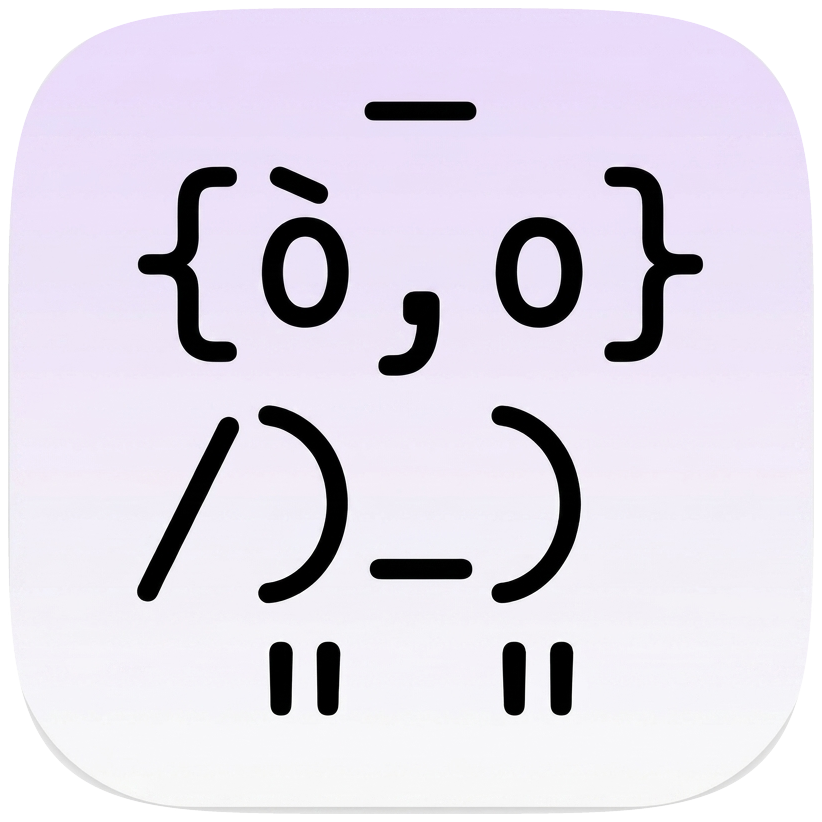

> [!WARNING]
> This project is still incomplete and not really suitable for practical use yet — but it's a fun one to experiment with as a recreational project.

<div align="center">
  <a href="assets/app_icon_better.png">
    
  </a>
</br>
<strong>qw</strong>owl35
</br>
(pronounced /kwaʊl/, a portmanteau of <strong>Qwen</strong> and <strong>owl</strong>)
</br>
<em>A <strong>Metal-backed</strong> inference engine for Qwen 3.5.</em>
</br>
</div>
</br>
</br>

Designed to sit inside **agentic loops** on a MacBook Air M2.

For facts about the served model itself — architecture, weight formats,
reasoning modes, chat encoding, sampling — see [`MODEL_CARD.md`](MODEL_CARD.md).

## Motivation

This project started with a simple goal: to run **Qwen 3.5 9B** — a model small
enough to fit, yet capable enough to assist with light coding tasks — entirely
on my local machine, a **MacBook Air M2**. From there it grew into a playground
for exploring optimization on several fronts: token efficiency, smarter
tool-calling, threading during inference, and a friendly user interface.

It is not meant to be a product for the public. It's a recreational experiment —
I do it because it's fun. My hope is that some of the things I ran into along the
way turn out to be useful to other programmers.

## What I've learned so far

- **`gf4` quantization is pure and uniform.** Every layer is quantized to
  exactly 4 bits per weight. It is a 4-bit *grouped floating point* format: 8
  values are packed into 32 bits, using a 3-bit quantized scale per value plus a
  single fp8 scale shared across the group. The format comes from zeux's
  [`calm`](https://github.com/zeux/calm); here it's used as an optional
  decode-time sidecar, where the smaller weights buy faster generation on the
  memory-bound decode path — still very much a work in progress.
- **Anchor-based file editing is token-efficient.** The editing tools key off
  `<line number><checksum>|<code>` anchors (e.g. `12af|    return x`) instead of
  the classic "replace old string with new string" approach, which costs
  noticeably fewer tokens for the same edit. The line number is followed directly
  by a two-hex checksum of the line's content, with no separator; the checksum
  lets an edit confirm it's still targeting the line it read, and the compact form
  tokenizes cheaply in the model's own BPE vocabulary.
- **Tool calls should respect what the model already learned.** This shows up
  in the BPE tokenization: it's not only the *format* that matters (here, an XML
  block with a specific structure the model was trained on), but also the *tool
  names*. Names should be chosen so they're emitted as single tokens — the
  vocabulary already contains many common function names that tokenize to one
  token, and leaning on those keeps tool-calling cheaper and more reliable.
- **Fine-tunes can quietly break the tool-call format.** I tried other
  fine-tuned variants of Qwen 3.5 9B, such as Qwopus3.5 or Ornith-1.0, but ran into problems.
  Some of them — especially ones distilled or tuned from larger models — lost
  the ability to emit tool calls in the exact format Alibaba's team trained the
  base model on, which in turn breaks their agentic capabilities. Ironically,
  the extra "tool-calling reinforcement" these tunes applied is what confused
  the model: instead of strengthening the behavior, it pulled the model away
  from the predetermined XML output it had already learned to produce. The stock
  model's adherence to that format turns out to matter a lot.
- **Different GPU layouts want different thread decompositions.** How work is
  split across threads during inference has to change with the layout; there is
  no single partitioning that's best everywhere.
- **Restricted bash plus a parsing policy is a solid first security layer.**
  Running a restricted bash, combined with a policy that parses commands to
  separate the suspicious from the benign, seems to be an effective first line
  of defense.
- **An adaptive KV-cache window pays off.** Letting the cache grow to fit the
  context instead of preallocating it saves a meaningful amount of memory. The
  cache grows by adding room in fixed chunks that are left in place, so long
  sessions stay smooth and fast.
- **`q8_0` is the smallest quantization I'd actually trust** — and even then I
  still have doubts about what that numerical compression really costs.
- **The MacBook runs *hot*.** Sustained inference heats it up enough that an
  external cooling setup is essentially required.

## Layout

- `qw35-server/` — Rust crate. The HTTP inference server and the Metal
  engine (lib `qw35_server`, binary `qw35`).
- `qw35-bench/` — Rust crate. The benchmark binary (`qw35-bench`), with
  `http`, `direct`, and `host` subcommands. Depends on `qw35-server`.
- `qw35-client/` — Python. Interactive REPL that talks to the server
  (`python -m qw35_client`).
- `tools/` — Python. Offline utilities: GGUF metadata dumper and
  the unified-model cooker (bakes GF4 FFN + AWQ into the `.gguf`).
- `qw35-agent/` — Python. `qwowl35`, a Textual terminal coding agent that
  drives the server in a tool-calling loop (`python -m qwowl35`).
- `.gguf/` — The base GGUF and the cooked unified model (kept at the repo
  root so the server's cwd-relative default path resolves).

## Getting the model

The weights are git-ignored, so a fresh checkout has none. Fetch them with:

```
./download_model.sh         # prebuilt unified Qwowl3.5-9B.gguf (default, ~4.8 GB)
./download_model.sh model   # base GGUF -> .gguf/Qwen3.5-9B-Q4_K_M.gguf (~5.3 GB)
./download_model.sh cook    # cook the unified Qwowl3.5-9B.gguf locally (CPU-heavy)
./download_model.sh all     # base GGUF, then cook
```

The unified model the server loads by default — `Qwowl3.5-9B.gguf` — can be
fetched two ways:

- **Download it directly** (default, recommended) with `./download_model.sh`,
  which pulls the prebuilt file from
  [`EmilioSchi/Qwowl3.5-9B-GGUF`](https://huggingface.co/EmilioSchi/Qwowl3.5-9B-GGUF)
  on Hugging Face — no cooking needed.

- **Cook it locally** with `./download_model.sh cook`, which bakes it from the
  base GGUF with `tools` (needs `python3` + `numpy` + `gguf`, and the AWQ
  activation stats — see the section below).

The base GGUF (`./download_model.sh model`) comes from `unsloth/Qwen3.5-9B-GGUF`
and is only needed as the cook input and the quality-comparison reference. Pass
`--token` (or set `HF_TOKEN`) for authenticated downloads, and `QW35_GGUF_DIR` to
change the target directory. If you start the server (`make run`) without the
model, it offers to run the downloader for you.

## Quickstart

With the model in place (see above), start the server, then drive it from the
**qwowl35** terminal agent:

```bash
# 1. start the inference server (listens on 127.0.0.1:8080)
make run                                    # or: cargo run --release -p qw35-server --bin qw35

# 2. in another terminal, launch the TUI agent
pip install -r qw35-agent/requirements.txt    # textual, rich, httpx, xxhash
cd qw35-agent && python -m qwowl35
```

Type a request (e.g. *"write a quicksort in Python and run it"*) and the agent
will think, call its bash/file tools, and stream the result. The bundled REPL
(`python -m qw35_client`) talks to the same server if you'd rather chat without
the tooling.

See [**qwowl35: the terminal agent**](#qwowl35-the-terminal-agent) below for
flags and the full picture.

## qwowl35: the terminal agent

`qw35-agent/` ships **qwowl35**, a terminal coding agent built on
[Textual](https://github.com/Textualize/textual) that drives the server in a
streaming tool-calling loop, with an animated owl mascot top-left mirroring the
agent's live state (prefill → thinking → inference → bash → edit → done).

The user picks the operating mode before each prompt — a Vim-style label in
the bottom-left corner shows it, **Shift+Tab** (or `/mode`) cycles it, and it
locks while the model generates. **NORMAL** (the default) runs the freestyle
executor (safety-gated **bash** + an *editor* sub-agent applying every file
change, shown as **INSERT** while it runs). **PLAN** runs a *planner* (todos +
a plan-approval gate) that gathers codebase facts by spawning stateless
read-only *explorer* sub-agents through its `explore` tool (shown as
**VISUAL**; each explorer reports back through one `resume` summary), then
hands the approved todos to executors that continue ONE persistent
conversation — each todo re-prefills only its directive thanks to the
server's checkpoint stack (`--checkpoints`). **WEB** and **CHAT** run a
fetch-restricted and a tool-less conversational agent. Every agent is fully
segregated: its own system prompt, only its own tools, exactly the data
handed over to it; the editor and explorer run on a separate scratch GPU
session (`--scratch-ctx`) so they never disturb a stage in progress.

<p align="center">
  
</p>

```bash
pip install -r qw35-agent/requirements.txt   # textual, rich, httpx, xxhash
cd qw35-agent && python -m qwowl35           # server must listen on 127.0.0.1:8080
python -m qwowl35 --think auto --reasoning-effort high   # --think auto is the default
```

Configuration is CLI-only (`--base-url`, `--think auto|on|off`,
`--reasoning-effort`, `--restricted-bash`); the mode is chosen inside the TUI.
Run artifacts (mode, exploration reports, plan, per-task results) land under
the user cache dir next to the prompt history and are cleaned up by age. See
[`qw35-agent/qwowl35/README.md`](qw35-agent/qwowl35/README.md) for the design
notes, key bindings, and the headless debug runners (`debug/headless.py
--mode plan` drives the planner pipeline unattended).

## Context window

`--ctx` sets the window the backend allocates. The default is the throughput
sweet spot, not the full trained window:

| `--ctx` | KV cache (q8_0) | prefill | TTFT | notes |
|---------|-----------------|---------|------|-------|
| **131072 (128K, default)** | ~2.1 GiB | full speed | <0.5 s | recommended |
| 262144 (full window) | ~4.2 GiB | ~2.5 tok/s | ~3 s | decode also drops ~16% |

`--kv-cache-type f16` makes the cache ~1.9× larger than `q8_0`; pass a smaller
`--ctx` on memory-constrained machines.

## The unified model: GF4 + AWQ

The server loads a single self-contained `.gguf`: the base GGUF with its FFN
gate/up/down tensors baked as **GF4** (eight 3-bit quants plus an fp8 scale per
32-bit word, GGUF type-id 100) and an **AWQ** per-channel scale folded into the
post-attention norms. GF4 drives both the single-token decode matvec and the
tiled multi-token prefill matmul, so there is no separate sidecar, no duplicate
Q4_K FFN, and one mmap (~4.8 GiB). The cooker is
`tools/cook_qw35_awq_gf4.py MODEL.gguf OUT.gguf --awq act-stats.bin`.

The canonical build is **`Qwowl3.5-9B.gguf`**, cooked with the AWQ-GF4 approach.
It was chosen by cooking
both `awq-gf4` and a plain `gf4` (no AWQ) variant and comparing each, cold, against
the base Q4_K GGUF (teacher-forced cross-engine quality report,
`real_model_unified_quality_report`, M2 16 GB):

| unified variant | top-1 agreement vs base | mean KL | argmax flips |
|-----------------|-------------------------|---------|--------------|
| **awq-gf4 (canonical)** | **89.8%** | **0.038** | **5/49** |
| gf4 (no AWQ)            | 85.7%     | 0.062   | 7/49       |

AWQ wins on every axis at identical decode speed (~17 tok/s; both variants share
the same GF4 FFN tensors — AWQ only rescales the norm and gate/up columns). The
base GGUF is retained purely as this comparison's reference.

qw35's greedy output on the loop-probe is byte-identical to
llama.cpp's. The `real_model_decode_path_parity_report` ignored test
measures decode-vs-prefill logit parity (GF4's 3-bit body still flips
the occasional argmax versus base weights; the exact Q6_K head keeps
token selection clean).

## The reranker: Qwowl3-Reranker-0.6B

The same server process hosts a second, much smaller model: a
**Qwen3-Reranker-0.6B** (llama.cpp rank conversion — dense Qwen3, a yes/no
`cls.output` classification head, `sigmoid(z_yes − z_no)` scoring) served on
`POST /v1/rerank`:

```sh
./download_model.sh reranker     # fetch qwen3-reranker-0.6b-q8_0.gguf (once)
./target/release/qw35            # auto-loads it when present on disk
curl -s localhost:8080/v1/rerank -d '{"query":"...","documents":["...","..."]}'
```

`--reranker-model FILE` overrides the auto-loaded file, `--no-reranker` skips
it; with no reranker the endpoint answers `501 inference_unavailable` and
nothing else changes. The reranker is its own engine
(`qw35-server/src/reranker/`) over its own mmap and tokenizer vocab; it reuses
the shared Metal runtime parameterized for a dense model (every layer
attention, ungated Q via a function constant, 128-dim full-head RoPE) plus a
shared-prefix KV reuse so all documents of a request evaluate the
system+instruct+query prefix once. Scores match llama.cpp's RANK pooling to
Pearson r > 0.9999 with identical top-1 (`tools/rerank_parity.py`).

Like the 9B, the reranker has a cooked unified edition,
**`Qwowl3-Reranker-0.6B.gguf`** (FFN baked GF4 + AWQ fold into `ffn_norm`,
scale-search on), produced by `tools/cook_qwowl3_reranker_gf4.py` from
act-stats captured on real rerank prompts
(`tools/capture_reranker_act_stats.py`). Unlike the 9B, though, **the raw
q8_0 file is the recommended serve**: rerank is prefill-bound, and measured
end-to-end (`tools/rerank_compare.py`, 100 queries × 4–64 docs) GF4 brings
no latency win (~286 vs ~273 ms/doc — noise) while costing ranking fidelity
on a 0.6B (top-1 agreement vs q8_0: 93%; relevant-subset rank correlation
0.85, vs a 0.94 cross-engine noise floor) — it only saves ~180 MB. An
AWQ-alpha sweep (0.4/0.6/0.8/off) confirmed alpha 0.6 as the best cook; the
gap is inherent to 3-bit FFN on a model this small. The qwowl35 agent uses
this cross-encoder by DEFAULT to prune web_fetch results down to the
query-relevant chunks (`--rerank-scorer` picks another mode; every neural
mode fails open to BM25 when its backend is absent).

## Thanks

Built on the shoulders of [**ggml** / **llama.cpp**](https://github.com/ggml-org/llama.cpp)
(MIT, Copyright (c) 2023-2026 The ggml authors). qw35 reads ggml's GGUF
format, reuses its quantized block layouts (`q4_K`/`q5_K`/`q6_K`/`q8_0`)
and `rope_multi` (MRoPE) semantics, and its Metal tiled-matmul kernel is
derived from llama.cpp's. Greedy decode is validated byte-for-byte against
llama.cpp on the same GGUF. Thank you to Georgi Gerganov and the ggml
contributors.
